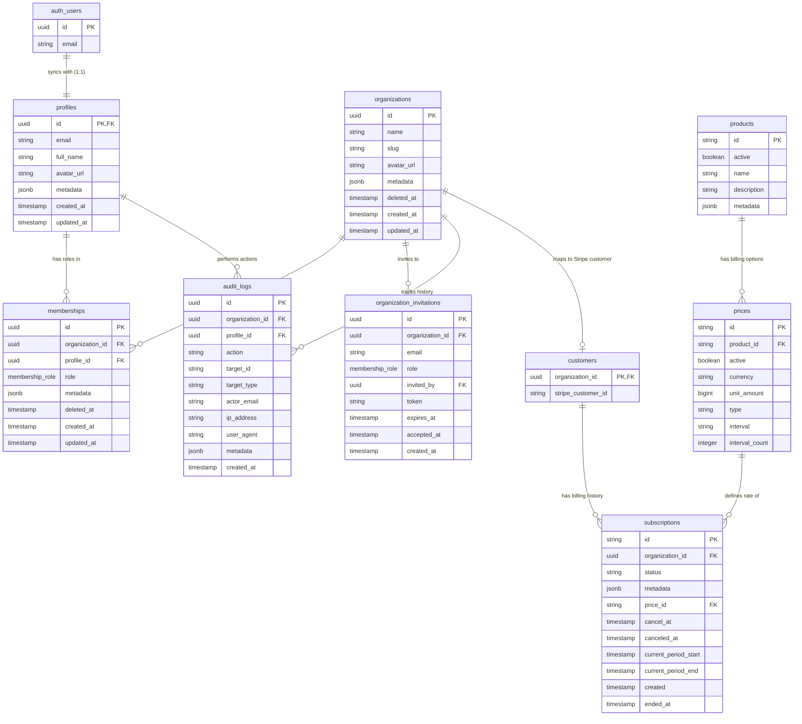

# Supabase SaaS Database & Auth Schema Design

This document details an industry-standard, production-ready PostgreSQL schema designed for multi-tenant SaaS applications using Supabase. It implements a multi-tenant hierarchy (Organizations/Workspaces), Role-Based Access Control (RBAC), and subscription management (e.g., Stripe integration) secured by Row Level Security (RLS) policies.

---

## 1. Architecture Overview & ERD

Below is the updated Entity Relationship Diagram (ERD) detailing the core entities, including billing, team invitations, and audit logging:



---

## 2. PostgreSQL DDL (Data Definition Language)

Run this SQL inside your Supabase SQL Editor. It creates all custom enums, tables, columns, indexes, and constraints.

```sql
-- Enable necessary extensions
create extension if not exists "uuid-ossp";

-- ==========================================
-- 2.1 CUSTOM ENUM TYPES & HELPER FUNCTIONS
-- ==========================================

-- Define Role types for Organization membership
create type membership_role as enum ('owner', 'admin', 'member', 'billing');

-- Define subscription statuses (aligned with Stripe statuses)
create type subscription_status as enum (
  'trialing',
  'active',
  'all_paid',
  'past_due',
  'canceled',
  'unpaid',
  'paused'
);

-- Common function to automatically update `updated_at` column
create or replace function update_updated_at_column()
returns trigger as $$
begin
    new.updated_at = now();
    return new;
end;
$$ language plpgsql;

-- ==========================================
-- 2.2 CORE ENTITY TABLES
-- ==========================================

-- 1. PUBLIC PROFILES (extends auth.users)
create table public.profiles (
  id uuid references auth.users on delete cascade primary key,
  email text unique not null, -- Cached email for easy client-side lookup/joins
  full_name text,
  avatar_url text,
  metadata jsonb default '{}'::jsonb, -- Flexible field for user preferences / onboarding state
  created_at timestamp with time zone default timezone('utc'::text, now()) not null,
  updated_at timestamp with time zone default timezone('utc'::text, now()) not null
);

comment on table public.profiles is 'Public user profile metadata linked 1:1 to auth.users.';
create index idx_profiles_email on public.profiles(email);

-- 2. ORGANIZATIONS (Multi-tenant workspaces)
create table public.organizations (
  id uuid default uuid_generate_v4() primary key,
  name text not null,
  slug text not null unique,
  avatar_url text,
  metadata jsonb default '{}'::jsonb, -- Store feature flags, settings, tier limits
  deleted_at timestamp with time zone, -- Support for soft deletion / restoration
  created_at timestamp with time zone default timezone('utc'::text, now()) not null,
  updated_at timestamp with time zone default timezone('utc'::text, now()) not null,
  constraint slug_length check (char_length(slug) >= 3)
);

comment on table public.organizations is 'Tenants/Workspaces that own SaaS resources.';
create index idx_organizations_slug on public.organizations(slug);
create index idx_organizations_active on public.organizations(id) where deleted_at is null;

-- 3. MEMBERSHIPS (RBAC linking users to organizations)
create table public.memberships (
  id uuid default uuid_generate_v4() primary key,
  organization_id uuid references public.organizations(id) on delete cascade not null,
  profile_id uuid references public.profiles(id) on delete cascade not null,
  role membership_role default 'member'::membership_role not null,
  metadata jsonb default '{}'::jsonb, -- Member-specific preferences or overrides
  deleted_at timestamp with time zone, -- Soft delete/suspend organization membership
  created_at timestamp with time zone default timezone('utc'::text, now()) not null,
  updated_at timestamp with time zone default timezone('utc'::text, now()) not null,
  -- Ensure user belongs to an organization only once
  unique (organization_id, profile_id)
);

comment on table public.memberships is 'Maps users to their organizations and roles.';
create index idx_memberships_profile on public.memberships(profile_id);
create index idx_memberships_org on public.memberships(organization_id);

-- 4. ORGANIZATION INVITATIONS (For team onboarding)
create table public.organization_invitations (
  id uuid default uuid_generate_v4() primary key,
  organization_id uuid references public.organizations(id) on delete cascade not null,
  email text not null,
  role membership_role default 'member'::membership_role not null,
  invited_by uuid references public.profiles(id) on delete set null not null,
  token text default md5(random()::text || clock_timestamp()::text) not null,
  expires_at timestamp with time zone not null,
  accepted_at timestamp with time zone, -- Track when registration/acceptance happened
  created_at timestamp with time zone default timezone('utc'::text, now()) not null,
  unique (organization_id, email)
);

comment on table public.organization_invitations is 'Pending invitations sent to team members.';
create index idx_invitations_token on public.organization_invitations(token);
create index idx_invitations_email on public.organization_invitations(email);

-- 5. AUDIT LOGS (SOC 2 and security logging standard)
create table public.audit_logs (
  id uuid default uuid_generate_v4() primary key,
  organization_id uuid references public.organizations(id) on delete cascade not null,
  profile_id uuid references public.profiles(id) on delete set null,
  action text not null, -- e.g. 'org.invite_sent', 'org.slug_updated', 'billing.updated'
  target_id text, -- ID of the affected resource
  target_type text, -- Type of resource e.g. 'member', 'settings'
  actor_email text, -- Cached at execution time in case user is deleted
  ip_address text,
  user_agent text,
  metadata jsonb default '{}'::jsonb, -- Action parameters/payload details
  created_at timestamp with time zone default timezone('utc'::text, now()) not null
);

comment on table public.audit_logs is 'SaaS Activity log for security audit compliance.';
create index idx_audit_logs_org_created on public.audit_logs(organization_id, created_at desc);

-- ==========================================
-- 2.3 STRIPE / BILLING TABLES
-- ==========================================

-- 1. PRODUCTS
create table public.products (
  id text primary key, -- Stripe Product ID (prod_...)
  active boolean,
  name text,
  description text,
  image text,
  metadata jsonb
);
comment on table public.products is 'SaaS pricing tiers mapped from Stripe products.';

-- 2. PRICES
create table public.prices (
  id text primary key, -- Stripe Price ID (price_...)
  product_id text references public.products(id) on delete cascade,
  active boolean,
  description text,
  unit_amount bigint, -- Stored in cents
  currency text check (char_length(currency) = 3),
  type text check (type in ('one_time', 'recurring')),
  interval text check (interval in ('day', 'week', 'month', 'year')),
  interval_count integer,
  metadata jsonb
);
comment on table public.prices is 'Stripe price details associated with product tiers.';

-- 3. CUSTOMERS
create table public.customers (
  organization_id uuid references public.organizations(id) on delete cascade primary key,
  stripe_customer_id text unique not null
);
comment on table public.customers is 'Links internal organizations to Stripe customer profiles.';

-- 4. SUBSCRIPTIONS
create table public.subscriptions (
  id text primary key, -- Stripe Subscription ID (sub_...)
  organization_id uuid references public.organizations(id) on delete cascade not null,
  status subscription_status not null,
  metadata jsonb,
  price_id text references public.prices(id),
  quantity integer,
  cancel_at_period_end boolean,
  created timestamp with time zone default timezone('utc'::text, now()) not null,
  current_period_start timestamp with time zone default timezone('utc'::text, now()) not null,
  current_period_end timestamp with time zone default timezone('utc'::text, now()) not null,
  ended_at timestamp with time zone,
  cancel_at timestamp with time zone,
  canceled_at timestamp with time zone,
  trial_start timestamp with time zone,
  trial_end timestamp with time zone
);
comment on table public.subscriptions is 'Stripe subscription state per organization.';
create index idx_subscriptions_org on public.subscriptions(organization_id);

-- ==========================================
-- 2.4 AUTOMATED COLUMN TRIGGER REGISTRATION
-- ==========================================
create trigger trigger_update_profiles_updated_at
  before update on public.profiles
  for each row execute procedure update_updated_at_column();

create trigger trigger_update_organizations_updated_at
  before update on public.organizations
  for each row execute procedure update_updated_at_column();

create trigger trigger_update_memberships_updated_at
  before update on public.memberships
  for each row execute procedure update_updated_at_column();
```

---

## 3. Database Triggers (Syncing `auth.users` to `public.profiles`)

This updated trigger function guarantees the email addresses of users are mirrored to the `public.profiles` table, enabling efficient user search and membership joins.

```sql
-- Trigger function to automatically create a public profile on signup
create or replace function public.handle_new_user()
returns trigger as $$
begin
  insert into public.profiles (id, email, full_name, avatar_url, metadata)
  values (
    new.id,
    new.email,
    coalesce(
      new.raw_user_meta_data->>'full_name',
      new.raw_user_meta_data->>'name',
      ''
    ),
    coalesce(
      new.raw_user_meta_data->>'avatar_url',
      ''
    ),
    '{}'::jsonb
  );
  return new;
end;
$$ language plpgsql security definer;

-- Bind the function to auth.users inserts
create trigger on_auth_user_created
  after insert on auth.users
  for each row execute procedure public.handle_new_user();
```

---

## 4. Helper Security Definer Functions (For Optimized RLS Policies)

```sql
-- Helper function to check if user is a member of an active (non-soft-deleted) organization
create or replace function public.is_org_member(org_id uuid)
returns boolean as $$
begin
  return exists (
    select 1
    from public.memberships m
    join public.organizations o on o.id = m.organization_id
    where m.organization_id = org_id
      and m.profile_id = auth.uid()
      and m.deleted_at is null
      and o.deleted_at is null
  );
end;
$$ language plpgsql security definer stable;

-- Helper function to retrieve the user's role in a specific organization
create or replace function public.get_org_role(org_id uuid)
returns membership_role as $$
declare
  user_role membership_role;
begin
  select role into user_role
  from public.memberships m
  join public.organizations o on o.id = m.organization_id
  where m.organization_id = org_id
    and m.profile_id = auth.uid()
    and m.deleted_at is null
    and o.deleted_at is null;
  return user_role;
end;
$$ language plpgsql security definer stable;
```

---

## 5. Row Level Security (RLS) Policies

```sql
-- Enable Row Level Security
alter table public.profiles enable row level security;
alter table public.organizations enable row level security;
alter table public.memberships enable row level security;
alter table public.organization_invitations enable row level security;
alter table public.audit_logs enable row level security;
alter table public.products enable row level security;
alter table public.prices enable row level security;
alter table public.customers enable row level security;
alter table public.subscriptions enable row level security;

-- ==========================================
-- 5.1 PROFILE POLICIES
-- ==========================================
create policy "Users can view all profiles"
  on public.profiles for select
  to authenticated
  using (true);

create policy "Users can update their own profile"
  on public.profiles for update
  to authenticated
  using (auth.uid() = id);

-- ==========================================
-- 5.2 ORGANIZATION POLICIES
-- ==========================================
create policy "Users can view organizations they are members of"
  on public.organizations for select
  to authenticated
  using (public.is_org_member(id) and deleted_at is null);

create policy "Owners and Admins can update their organization"
  on public.organizations for update
  to authenticated
  using (public.get_org_role(id) in ('owner', 'admin') and deleted_at is null);

create policy "Owners can soft delete their organization"
  on public.organizations for update
  to authenticated
  using (public.get_org_role(id) = 'owner');

-- ==========================================
-- 5.3 MEMBERSHIP POLICIES
-- ==========================================
create policy "Users can view memberships in their organizations"
  on public.memberships for select
  to authenticated
  using (public.is_org_member(organization_id) and deleted_at is null);

create policy "Admins and Owners can manage memberships"
  on public.memberships for all
  to authenticated
  using (public.get_org_role(organization_id) in ('owner', 'admin'));

-- ==========================================
-- 5.4 INVITATION POLICIES
-- ==========================================
create policy "Members can view invitations for their organization"
  on public.organization_invitations for select
  to authenticated
  using (public.is_org_member(organization_id));

create policy "Admins and Owners can manage invitations"
  on public.organization_invitations for all
  to authenticated
  using (public.get_org_role(organization_id) in ('owner', 'admin'));

-- ==========================================
-- 5.5 AUDIT LOG POLICIES
-- ==========================================
create policy "Members can view audit logs for their organization"
  on public.audit_logs for select
  to authenticated
  using (public.is_org_member(organization_id));

-- Audit logs are insert-only from backend / triggered events, prevent client modifications
create policy "No direct updates or deletes allowed on audit logs"
  on public.audit_logs for all
  to authenticated
  using (false);

-- ==========================================
-- 5.6 STRIPE BILLING READ-ONLY POLICIES FOR CLIENTS
-- ==========================================
create policy "Anyone can read products"
  on public.products for select
  using (active = true);

create policy "Anyone can read prices"
  on public.prices for select
  using (active = true);

create policy "Members can view organization subscriptions"
  on public.subscriptions for select
  to authenticated
  using (public.is_org_member(organization_id));
```
